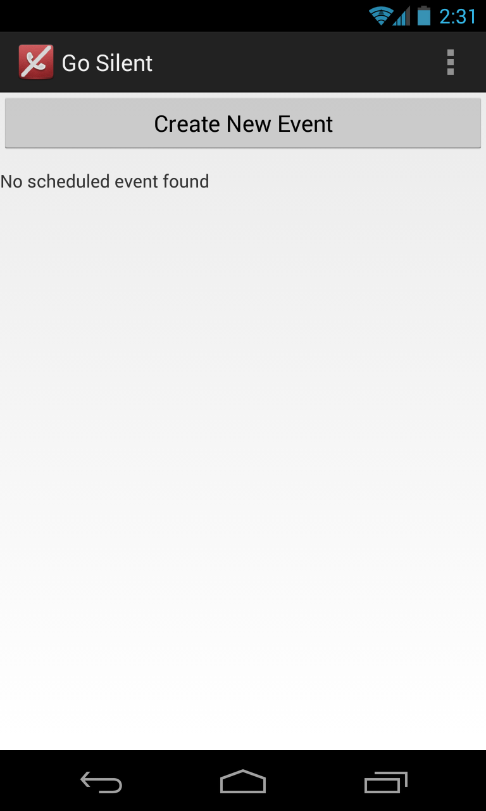
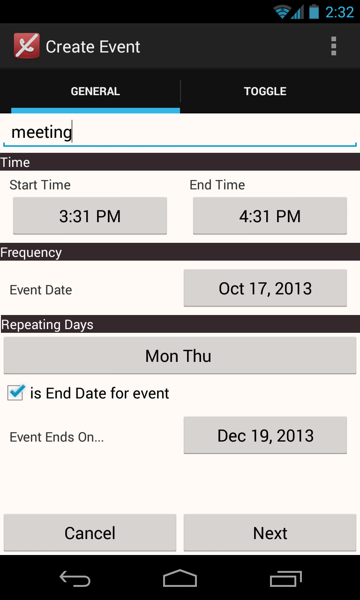
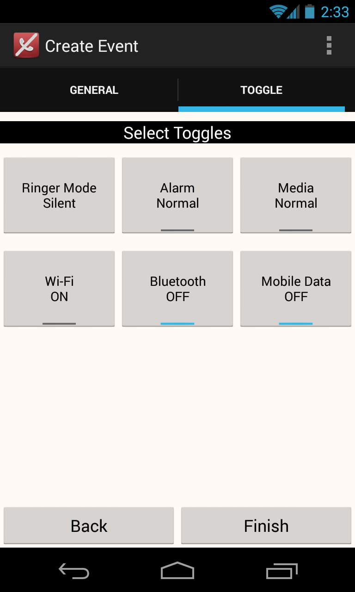
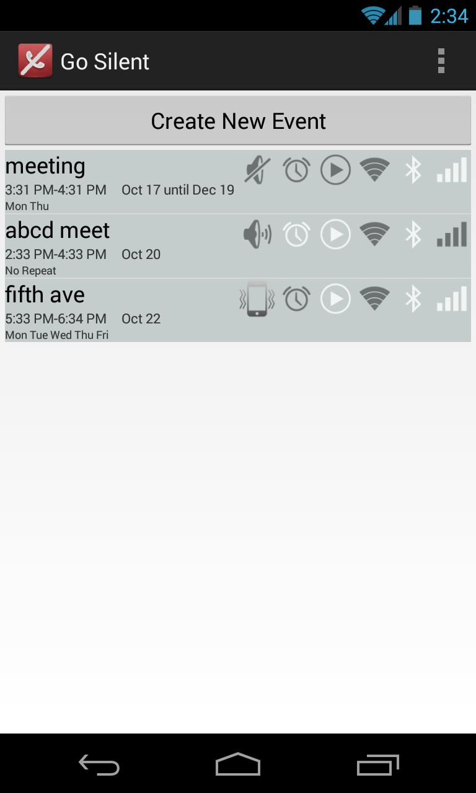

"Go Silent" helps you to toggle settings of your phone automatically for a scheduled event time.
You can set an event with various toggling modes available from the list of system and sound setting, toggling modes like ringer settings, media Setting, Alarm Setting, Wi-Fi Setting. Schedule these events for your day to day activities like meetings, movie time, driving and so on.
So with this app you need not worry anymore about manually switching your phone to silent mode before you enter a meeting room,movie theater, or switching it to a ringer mode when you are off work.
Simply put in your schedule, choose your toggles and set the event, and forget about it, the app will do the rest for you.

DOWNLOAD:

SCREENSHOTS : 

